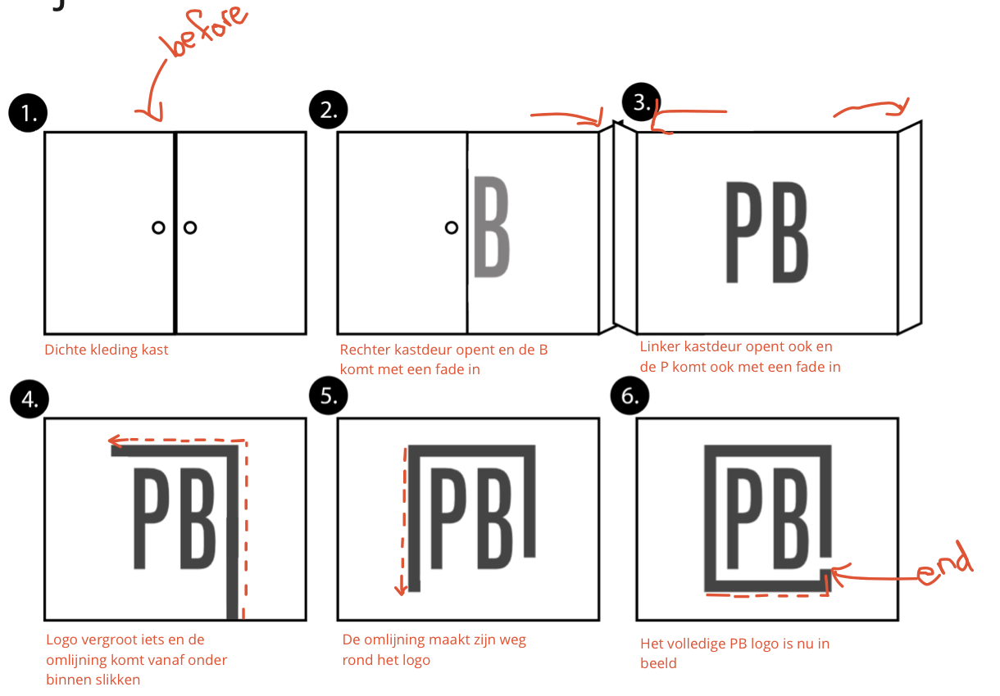
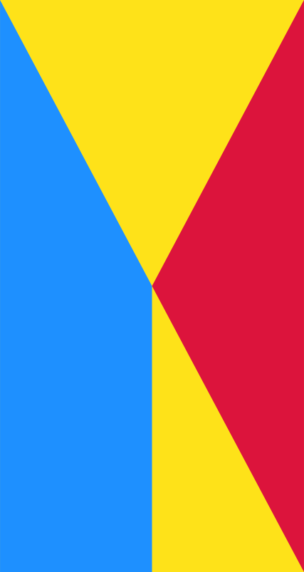

# Procesverslag
**Auteur:** Thasja Thoolen

**De opdrachten:** [opdracht 1](opdracht1/index.html) en [opdracht 2](opdracht2/index.html)

Markdown is een simpele manier om HTML te schrijven.  
Markdown cheat cheet: [Hulp bij het schrijven van Markdown](https://github.com/adam-p/markdown-here/wiki/Markdown-Cheatsheet).

Nb. De standaardstructuur en de spartaanse opmaak van de README.md zijn helemaal prima. Het gaat om de inhoud van je procesverslag. Besteedt de tijd voor pracht en praal aan je website.

Nb. Door *open* toe te voegen aan een *details* element kun je deze standaard open zetten. Fijn om dat steeds voor de relevante stuk(ken) te doen.

## Bronnenlijst
  1. -bron 1-
  2. -bron 2-
  3. -...-

## Opdracht 1 plan

  
Het logo dat ik heb gekozen is het logo van Perfectly Basics. Dit is een online kleding webshop met premium dames mode. Ik heb er dan ook voor gekozen om de letters van het logo in het begin van mijn annimatie tevoorschijn te laten komen uit een kledingkast. Eerst zal de rechter deur open gaan en daarna de linker deur. Hierna zal het logo iets vergroten en komt de omlijning vanaf onder in beeld tevoorschijnt en 'loopt' deze een route om de letters heen tot het het eind logo vormt. 

  ### Je storyboard:
  

  ### Je ambitie: 
  Aan deze technieken/punten wil ik werken:
  - punt 1: Ik vind het belangrijk dat ik het basis-annimeren beter onder de knie krijg omdat dit mijn eerste kennismaking hiermee is.  
  - punt 2: Ik wil sneller een link kunnen leggen tussen opmaak en elementen omdat ik hier soms nog wel moeite mee heb
 

## Opdracht 1 reflectie

  
uitwerken bij afronden opdracht (voor week 3)

  ### Je uitkomst - karakteristiek screenshot(s):
  

  ### Dit ging goed/Heb ik geleerd: 
  Korte omschrijving met plaatje(s)

  

  ### Dit was lastig/Is niet gelukt:
  Korte omschrijving met plaatje(s)
  
Ik heb in het begin van deze opdracht veel moeite gehad met het font. Deze had ik opgestuurd gekregen van PB zelf, alleen was het nog een heel proces om deze werkend te krijgen in mijn website

  

## Opdracht 2 plan

  
uitwerken na schetsen idee (voor week 4)

  ### Je ontwerp:
  

  ### Je ambitie: 
  Aan deze technieken/punten wil ik werken:
  - punt 1
  - punt 2
  - nog een punt
  - ...

## Opdracht 2 test

  
uitwerken na testen (week 6/7)

  Neem minimaal 5 bevindingen op:

  ### Bevinding 1:
  Omschrijving van wat er nog niet orde was (tekst en afbeeding(en)).

  #### oplossing:
  Beschrijving hoe je het hebt hebt opgelost of als het niet gelukt is hoe je het zou oplossen (tekst en afbeeding(en)).

  ### Bevinding 2:
  Omschrijving van wat er nog niet orde was (tekst en afbeeding(en)).

  #### oplossing:
  Beschrijving hoe je het hebt hebt opgelost of als het niet gelukt is hoe je het zou oplossen (tekst en afbeeding(en)).

  ### Bevinding 3:
  ...

## Opdracht 2 reflectie

  
uitwerken bij afronden opdracht (voor week 8)

  ### Je uitkomst - karakteristiek screenshot(s):
  

  ### Dit ging goed/Heb ik geleerd: 
  Korte omschrijving met plaatje(s)

  

  ### Dit was lastig/Is niet gelukt:
  Korte omschrijving met plaatje(s)

  

